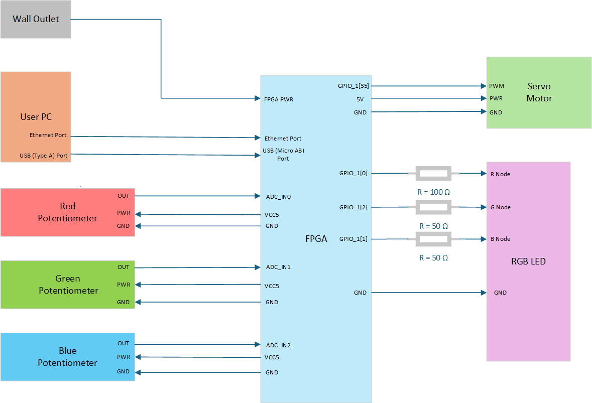

## Table of Contents
- [About](#-about)
- [How to Build](#-how-to-build)


## About

The goal of this project was to create a system that can change the RGB color values of an RGB LED by turning their corresponding potentiometers. Additionally, I added on a hardware servo motor that changes its position based on software that checks what color the RGB LED is, sending over a corresponding pwm signal to the servo motor. The servo motor's arm is part of a gauge chart that lists the various RGB color possibilities, as can be seen in the picture below.


## 📝 How to Build

Note: this build section was created with the assumption that the user has followed the course up to the final project.

### Hardware:

The following is a wiring diagram for this project:



Check the DE10 Nano User Manual for pin locations.

### Software:

Here's a set-up guide for the software to make sure all the files are in their right places.

1. Navigate to /srv/tftp/de10nano/bootscripts on your VM.
2. Add the files under /final-project-dylan/linux/file_jambalaya/bootscripts to that folder.
3. Create a folder titled "final-project" in the /srv/tftp/de10nano/ folder on your VM.
4. Add the files under /final-project-dylan/linux/file_jambalaya/final-project/ to that folder.
5. Navigate to /srv/nfs/de10nano/ubuntu-rootfs/home/soc/ on your VM.
6. Add the files under /final-project-dylan/linux/file_jambalaya/soc/ to that folder.
7. Navigate to /final-project-dylan/linux/dts on your VM. 
8. Follow the README file in that folder to link the dts file.
9. Everything should be in the right place now!

**Quick note**: this project also has the device driver from the led_patterns portion still included, so if you want to add that driver, there's a .ko device file and a C program for it under /final-project-dylan/linux/file_jambalaya/extra that you can put into /srv/nfs/de10nano/ubuntu-rootfs/home/soc/.

Here's a load-up guide for the software side of this project.

1. Plug in the FPGA's micro AB port on the ethernet side to your PC.
2. Plug in the FPGA's ethernet port to your PC.
3. Load up PUTTY with the your DE10 Nano Saved Session.
4. Plug in the FPGA's power cord.
5. Wait for the autoboot...
6. Log in as soc.
7. Run the following commands to load up the device drivers
```
sudo insmod rgb_controller.ko
sudo insmod servo_controller.ko
sudo insmod de10nano_adc.ko
```
8. Run the following command to run the software's C program:

` sudo ./pot_RGB_Servo `
9. The terminal should tell you that you can now move your potentiometers for RGB LED lightup and Servo Movement!

[Back to top](#top)