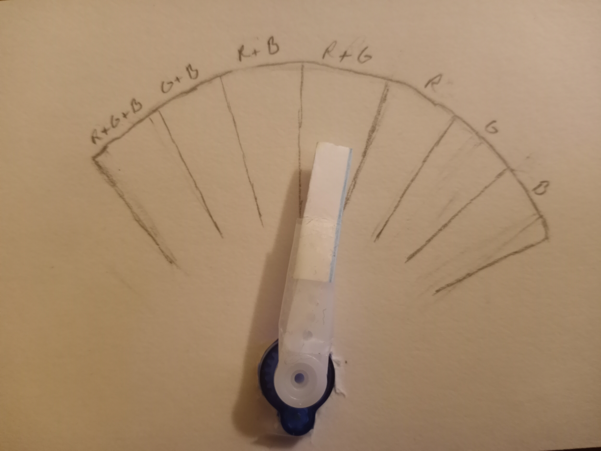

# Final Project: RGB LED and Servo Control via Potentiometers

## System Overview

The goal of this project was to create a system that can change the RGB color values of an RGB LED by turning their corresponding potentiometers. Additionally, I added on a hardware servo motor that changes its position based on software that checks what color the RGB LED is, sending over a corresponding pwm signal to the servo motor. The servo motor's arm is part of a gauge chart that lists the various RGB color possibilities, as can be seen in the picture below.

The installation and setup guide to get everything working as well as the Wiring Diagram for this project can be found in the top-level README file.

## Servo Motor Component

As was stated above, I integrated a servo motor into my design that changes its arm position based on the RGB LED's color.

Note: this project was completed without a partner, so only 1 component was implemented.

## Conclusion

Regarding the creation and execution of this project, I'd say things went pretty well! I feel like I've gained a lot of experience in the realm of Linux servers, Avalon setup, FPGA mastery, and more, which I feel will certainly aid me in my future career. 

As for improvements I'd like to see regarding this course, there's not much I feel I need to give. The course itself was well paced for the most part and I enjoyed the freedom that Trevor gave us in terms of the class attendence and his willingness to help after-hours. 
The only part of the class that I feel might want to be changed is the feedback on the labs (like Lab 4 and Lab 8). While the feedback itself was very high quality and in-depth, the timing of it seemed to be a bit late, considering they came after we had started working on our final projects. Maybe for future semesters, instead of giving everyone individual feedback on their code, there could instead be an example project released after the lab due date that people could use to compare and correct their code? Again, the issue itself wasn't the feedback, it was super insightful and well-done, it's just that the timing of the feedback made it difficult to go back and correct our code since I, and I assume most others in the class, wanted to prioritize the final project. 

Thanks!
