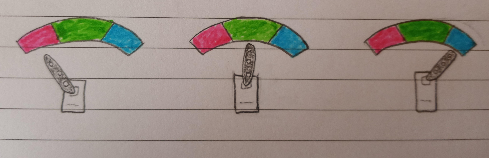

# Final project proposal

## Hardware/software proposal 1
Hardware:
- Servo motor with position based on the selected LED (will add an additional RGB LED to allow for choosing functionality)

Software:
- Software for choosing what LED will be watched + software to change the servo motor position based on that LED's color

## Hardware/software proposal 2
Hardware: 
- Temperature sensor. KY-015 DHT11.  

Software:
- Software that takes the value range of the sensor and outputs an RGB color.

## Extra credit
N/A

## Division of labor

Dylan - Working on Hardware for proposal 1 and software for proposal 2

Jessica - Working on Hardware for proposal 2 and software for proposal 1

