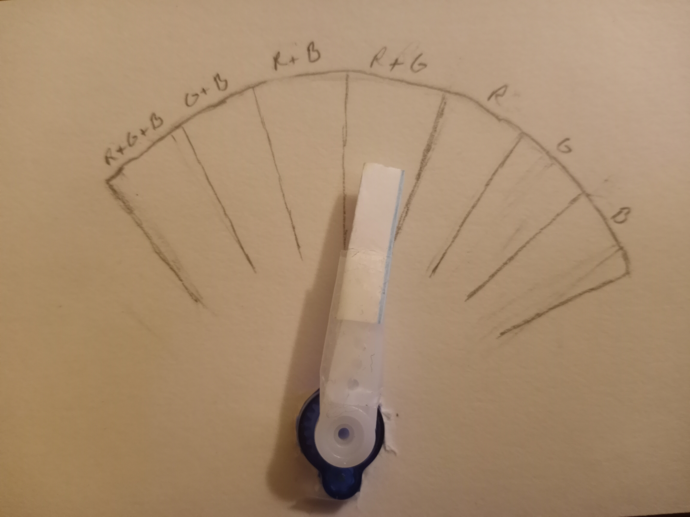

# Servo controller driver for the DE10 Nano

In order to communicate with the servo controller component, we need to create a driver for it. This driver will function very similarly to the RGB controller driver.

## Building

The Makefile in this directory cross-compiles the driver. Update the `KDIR` variable to point to your linux-socfpga repository directory.

Run `make` in this directory to build the kernel module.

## Device tree node

Use the following device tree node:
```devicetree
servo_controller: servo_controller@ff201000 {
    compatible = "Raber,servo_controller";
    reg = <0xff201000 16>;
};
```

## Notes / bugs :bug:

No notable bugs!! As a quick note, the duty cycle register accepts values from 0 to 255;

## Register map

| Offset | Name         | R/W | Purpose                                                              |
|--------|--------------|-----|----------------------------------------------------------------------|
| 0x0    | duty_cycle   | R/W | Sets the duty_cycle of the PWM signal being sent to the micro servo  |

## Documentation

N/A

------------------------------------------------------------------------------------------------------------------------------------------------

# Potentiometer-RGB-Servo C Program

This program basically adds onto the potentiometer-led C program in the adc directory. It has all the same functionality as that program, and in addition, it determines what combination the RGB LED is in (ex: red, red+blue, red+blue+green) and sends off a pwm value to the servo. That pwm value makes the servo's "hand" sit in one of a number of boxes in a gauge chart that say what color combo the RGB LED is (likely) giving off:



## Building

To compile the program, run the following command in the terminal of this directory (while on your VM):

`/usr/bin/arm-linux-gnueabihf -gcc -o pot_RGB_Servo pot_RGB_Servo.c`

Now all you have to do is put it on your nfs server where you can run it (ex: /srv/nfs/de10nano/ubuntu-rootfs/home/soc).

## Notes / bugs :bug:

You can exit out of the code using Ctrl+C. Make sure you're adc_controller and rgb_controller devices are loaded into the device tree, otherwise the program won't work. When all the potentiometers are turned down all the way (ie. the RGB LED should be off), the servo will stay in place until the LED lights up again.

## Documentation

N/A